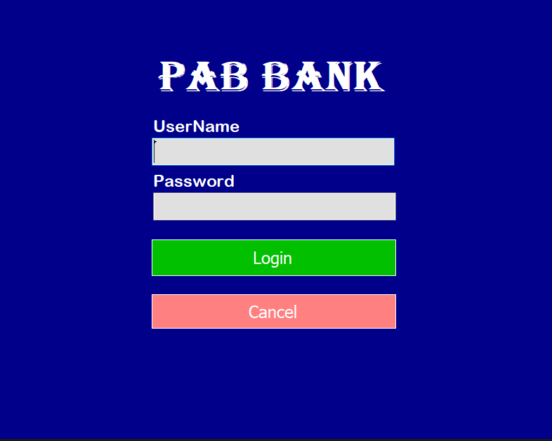
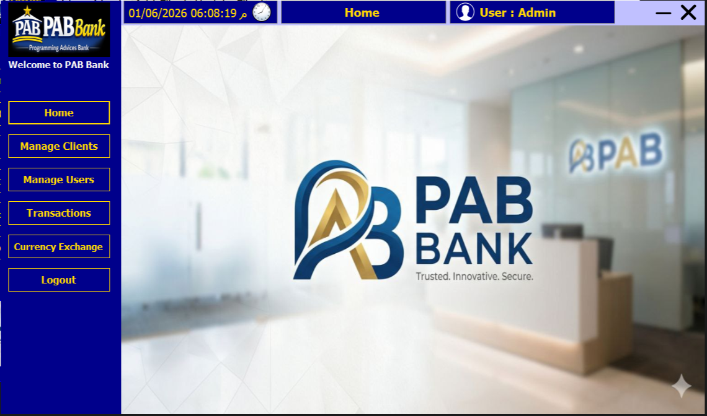
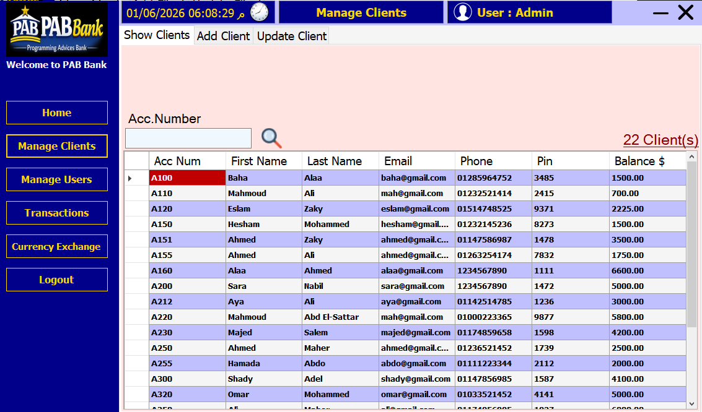
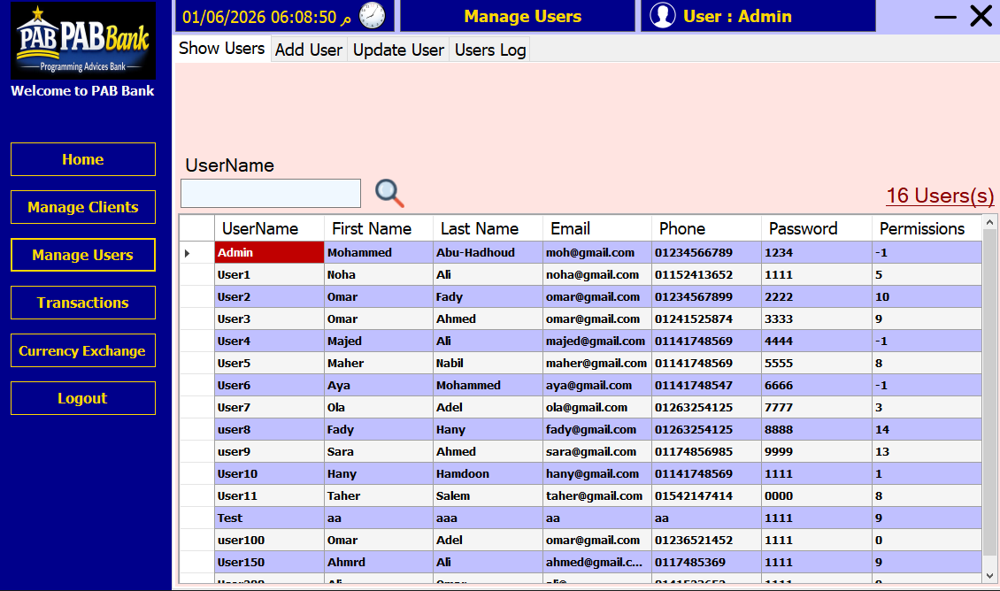
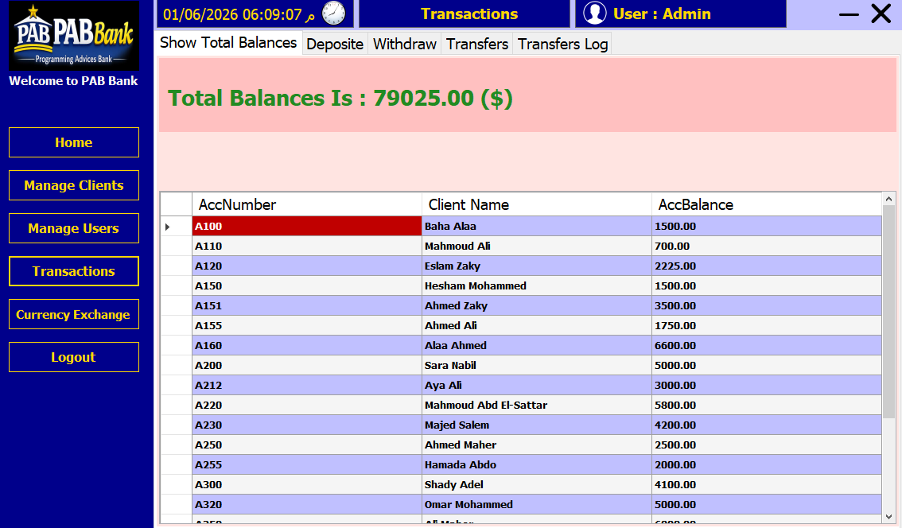
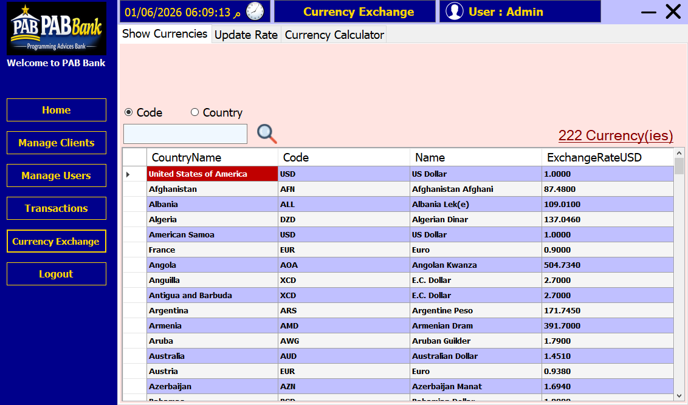

# 🏦 Bank Management System — C# WinForms

A fully object-oriented C# Bank Management System with a Windows Forms GUI, built on a 3-layer architecture and SQL Server as the database backend.

---

## 📖 Overview

This is the Windows Forms version of the Bank Management System — an upgrade from the console-based version. The system features a modern desktop GUI for managing bank clients, users, and transactions, with secure login, role-based permissions, and full database persistence via SQL Server. A `Bank.drawio` diagram documents the database schema.

---

## 🖼️ Screenshots

| Login | Home |
|---|---|
|  |  |

| Manage Clients | Manage Users |
|---|---|
|  |  |

| Transactions | Currency Exchange |
|---|---|
|  |  |

---

## ✨ Features

- **Login System**: Secure authentication with username and password
- **Role-Based Permissions**: Bitwise permission flags control access per feature per user
- **Client Management**: Full CRUD operations (Add, Delete, Update, Find, List)
- **User Management**: Full CRUD operations for system users
- **Transactions**: Deposit, Withdraw, Transfer between accounts, and Total Balance reporting
- **Transfer Log**: All transfer transactions recorded in the database
- **Login Log**: All login events recorded with timestamp
- **Currency Management**: View and manage currencies with exchange rates
- **Windows Forms GUI**: Full desktop interface replacing the console-based UI
- **Logout**: Return to login screen without exiting the application

---

## 🛠️ Tech Stack

| Component | Technology |
|---|---|
| Language | C# (.NET) |
| UI | Windows Forms (WinForms) |
| Architecture | 3-Layer (Data / Business / WinForms) |
| Database | SQL Server |
| Data Access | ADO.NET |
| DB Diagram | Draw.io (`Bank.drawio`) |
| IDE | Visual Studio 2022+ |

---

## 🎮 How to Use

1. Run the application — a **Login Form** appears first.
2. Enter your username and password to authenticate.
3. The **Main Dashboard** opens based on your assigned permissions.
4. Navigate through the menu to manage:
   - Clients (Add, Edit, Delete, Find, List)
   - Users (Add, Edit, Delete, Find, List)
   - Transactions (Deposit, Withdraw, Transfer, Balances)
   - Currencies
   - Transfer Log
   - Login Log
5. Click **Logout** to return to the login screen.

---

## 🏗️ Project Structure

```
p20-Bank-System-C-Sharp-Windows-Forms/
│
├── Bank-Data-Layer/         # ADO.NET — direct SQL Server communication
│   ├── clsClientData.cs
│   ├── clsUserData.cs
│   └── clsCurrencyData.cs
│
├── Bank-Business-Layer/     # Business logic and validation
│   ├── clsClient.cs
│   ├── clsUser.cs
│   └── clsCurrency.cs
│
├── Bank/                    # Windows Forms UI project
│   ├── Forms/               # All WinForms screen forms
│   └── Program.cs           # Application entry point
│
├── Shared/                  # Shared utilities and helpers across layers
│
├── Bank.drawio              # Database schema diagram
├── BankDb.bak               # SQL Server database backup
├── Bank.slnx                # Visual Studio solution file
└── README.md
```

---

## 🧠 Concepts Used

- **3-Layer Architecture** — Strict separation of Data Layer, Business Layer, and Presentation Layer
- **OOP** — Full class-based design with encapsulation across all layers
- **Windows Forms** — Desktop GUI with forms, controls, and event-driven interactions
- **ADO.NET** — Direct SQL Server communication using `SqlConnection`, `SqlCommand`, `SqlDataReader`
- **SQL Server** — Relational database for persistent data storage
- **Enums** — Permission flags and operation types
- **Bitwise Operations** — Assigning and checking user permissions
- **Static Methods** — Used in business and data layer classes for CRUD operations
- **Shared Layer** — Common utilities and helpers reused across multiple layers
- **Database Diagram** — `Bank.drawio` documents the database schema visually

---

## ⚙️ Requirements

- **IDE**: Visual Studio 2022 or later
- **Framework**: .NET (Windows Forms)
- **Database**: SQL Server (any edition)
- **Tools**: SQL Server Management Studio (SSMS) — to restore the database
- **OS**: Windows

---

## 🚀 Getting Started

**1. Clone the repository**

```bash
git clone https://github.com/mahmoud-abd-elsattar-dev/p20-Bank-System-C-Sharp-Windows-Forms.git
cd p20-Bank-System-C-Sharp-Windows-Forms
```

**2. Restore the database**

Open SSMS → right-click **Databases** → **Restore Database** → select `BankDb.bak`.

**3. Update the connection string**

In `Bank-Data-Layer`, update the connection string to match your SQL Server instance:

```csharp
static string connectionString =
    "Server=YOUR_SERVER_NAME;Database=BankDb;Integrated Security=True;";
```

**4. Open and run**

Open `Bank.slnx` in Visual Studio and press `F5` to run.

---

## 📄 License

This project is open source and free to use for educational purposes.

---

## 👤 Author

👤 **Mahmoud Abd El-Sattar**  
📧 mahmoud.abdelsattar.dev@gmail.com  
💼 [linkedin.com/in/mahmoud-abd-el-sattar](https://www.linkedin.com/in/mahmoud-abd-el-sattar-1b227522a)
